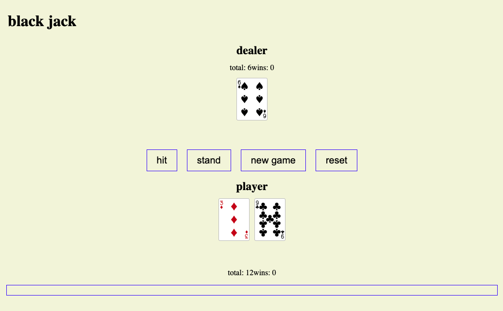
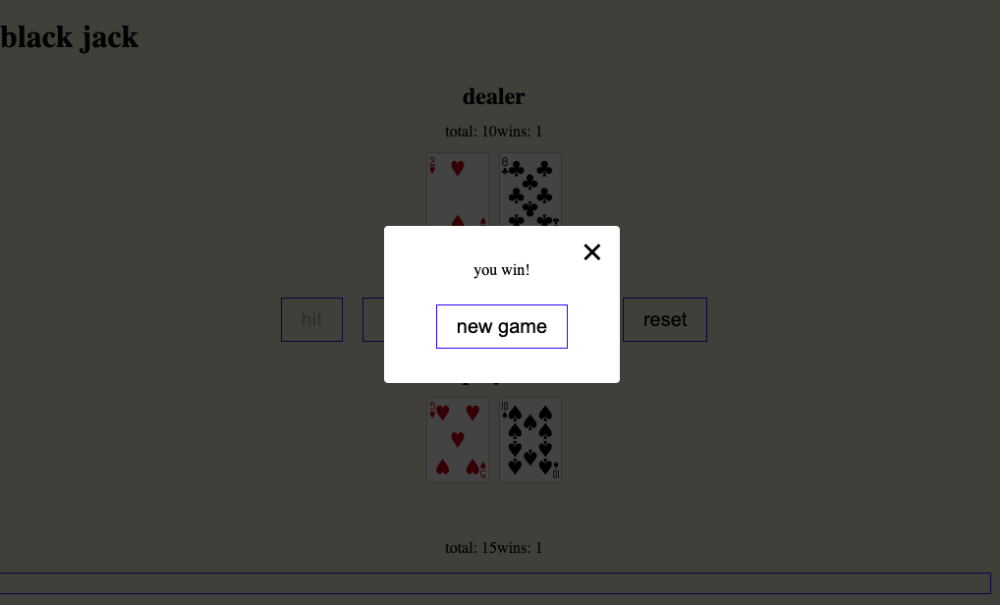

# **CHECKERS**

## Rules and General Overview

BlackJack is a single player game. The goal of the game is to get as close to 21 without going over 21. The player starts with 2 cards and the dealer starts with one. You have the choice to either hit or stand. If you choose to hit, a card will be added to your hand. When you choose to stand, the dealer flips his card. If either the player or the dealer ends up with a score over 21 then that person loses, if not then the person closest to 21 wins the hand.

## Special Conditions

- you can choose to hit: adding a card to your hand

- you can choose to stand: stop taking hits and seeing who wins the game

## Screenshots

## Technologies Used

- HTML
- CSS
- JavaScript

## Play the Game

The game can be accessed [here](https://mateasguenette.github.io/blackjackgame2/). 

## Future Work

- **Adding bets**. The original game allows gambling

- **Making the game a multiplayer mode**. A multiplayer mode would allow you and all your friends to play and gamble all  together.
